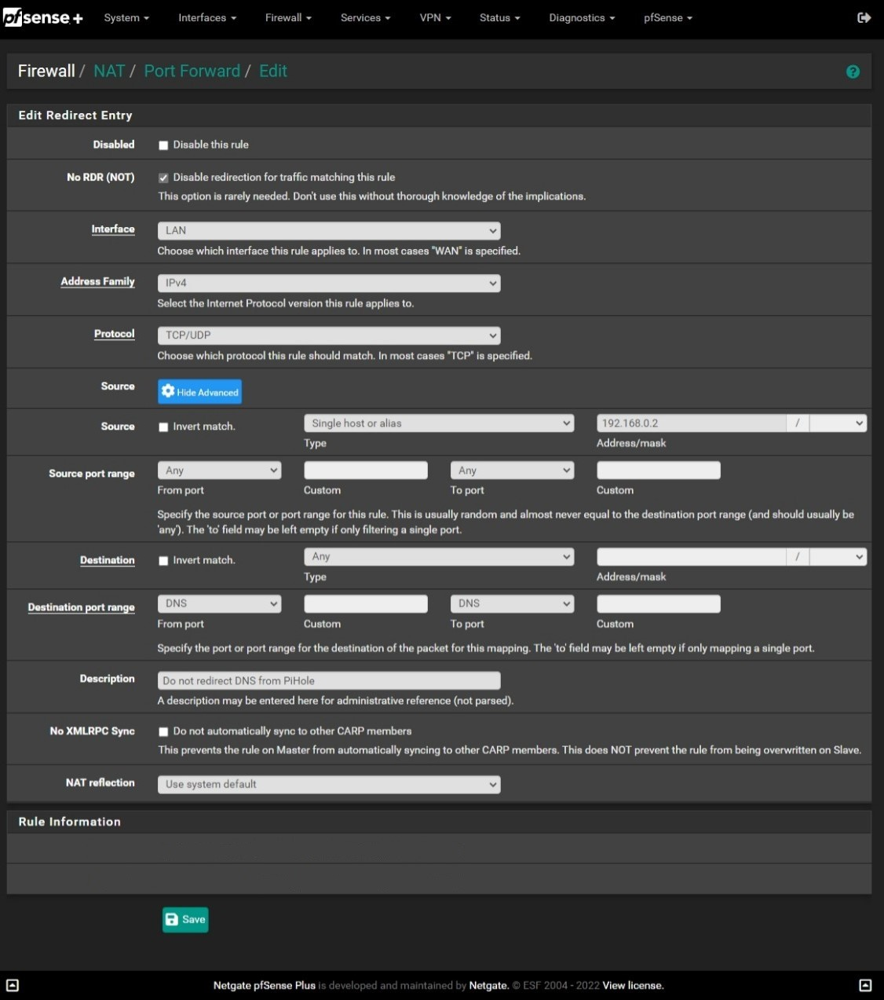
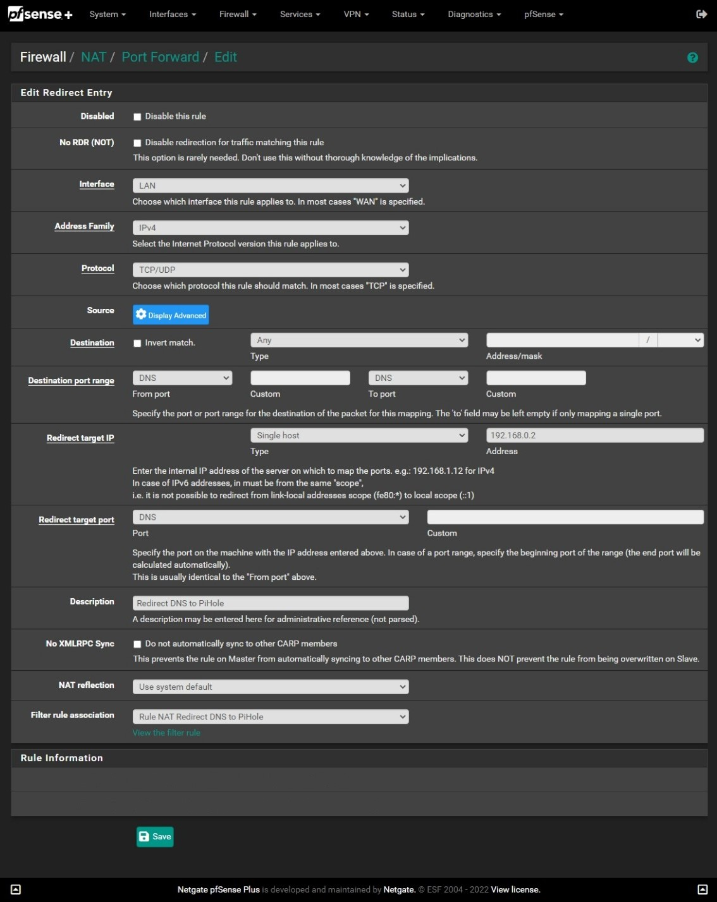
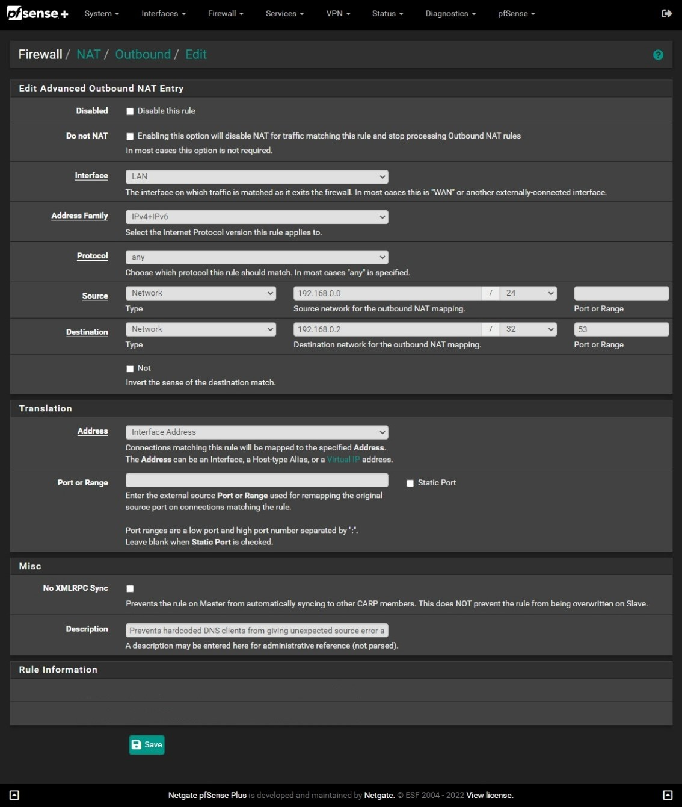

# PiHole-PFSense-Redirect
 <h1 align="center">How to redirect DNS traffic to PiHole</h1>

<h2 align="center">Create a rule so that DNS inquires from the PiHole are allowed</h2>

The first step is create a rule to not redirect DNS queries from the PiHole.

1. Firewall > NAT > Port Forward
2. Click add
3. No RDR (NOT) > checked
4. Interface > LAN
5. Address Family > IPv4
6. Protocol > TCP/UDP
7. Source > Click Show Advanced
8. Source > Single host or alias > PiHole's IP address
9. Source port range > Any
10. Destination port range > DNS
11. Click Save

  

<h2 align="center">Create a rule to redirect DNS traffic to the PiHole</h2>

This rule will force all DNS traffic to the PiHole

1. Firewall > NAT > Port Forward
2. Click add (down arrow)
3. Interface > LAN
4. Address Family > IPv4
5. Protocol > TCP/UDP
6. Destination > Any
7. Destination port range > DNS
8. Redirect target IP > Single host > PiHole's IP address
9. Redirect target port > DNS
10. Click Save

  

Makes sure the first rule created is above the second and click apply changes.

<h2 align="center">Fix reply from unexpected source</h2>

Right now all DNS traffic (port 53) is being redirected to the PiHole.  The problem that arises is that responses to DNS requests come from the PiHole IPv4 address when clients are expecting it their hardcoded DNS servers.

1. Firewall > Outbound
2. Outbound NAT Mode > Hybrid Outbound NAT rule generation. (Automatic Outbound NAT + rules below)
3. Save
4. Mappings > Add
5. Interface > LAN
6. Address Family > IPv4+IPv6
7. Protocol > Any
8. Source > Type > Network
9. Source > Source network for the outbound NAT mapping > Network CIDR
10. Destination > Type > Network
11. Destination > Destination network for the outbound NAT mapping >  PiHole IP / 32
12. Destination > Port or Range > 53
13. Translation > Address > Interface Address
14. Save

  

<h2 align="center">Blocking DoT and DoH servers</h2>

